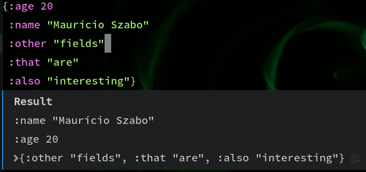
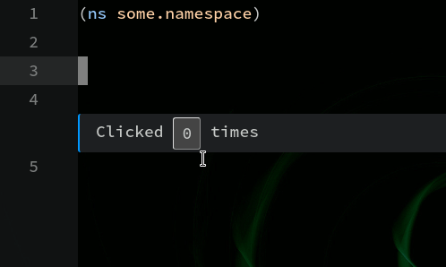

# Extending

Most editor plug-ins allow you for some customization. The idea of repl-tooling based plug-ins like Chlorine and Clover is to allow customization on a much deeper level.

There are a number of ways to configure plug-ins. They all rely on adding ClojureScript (in fact, SCI) code into a config file, and then save that file - the plug-in infrastructure will auto-reload everything, and you'll be able to see your custumization working immediately. Currently, these are the extension points:

1. [Add new commands](#Add-new-commands)
1. [Customize rendering of results](#Customize-rendering-of-results)
1. [Custom Node.JS renders (only Chlorine for now)](#Custom-renderers)
1. [Customize resolvers](#Customize-resolvers)

## Add new commands
First you'll run the command `Open Config`. Then, on this file, you'll add functions that will be converted to commands. For example, to add a command to explain a prismatic schema:

```clojure
(defn explain-schema []
  (p/let [editor-data (editor/get-var)]
    (when editor-data
      (-> editor-data
          (update :text #(str "(if (satisfies? schema.core/Schema " % ") "
                                  "(schema.core/explain " % ")"
                                  "(or (:schema (meta (ns-resolve *ns* '" % ")))"
                                       "\"Is not a schema\"))"))
          (editor/eval-and-render)))))
```

The commands will appear differently from editor to editor. On Atom, they'll just automatically appear on the command pallete, over the name `Chlorine: Explain Schema` for example. On Clover, they'll be under tasks - you'll have to run "Run task", then choose "Clover", and the commands will be there (because VSCode-like editors do not allow you to create custom commands on the fly). The reason Clover works like this is mostly because it's the ONLY WAY that's allowed to register keymaps. More info on [Clover's page](https://github.com/mauricioszabo/clover/blob/master/README.md#custom-commands).

Please, notice that `p/let` is being used instead of `let`: the reason is that some commands on Chlorine's side return Javascript's promises, and `p/let` is able to "wait" for then before running the next bindings.

### API for config file
The current (incomplete) API is:
* `editor/get-top-block`, `editor/get-block`, `editor/get-var`, `editor/get-selection` - Return the current text refering to top-block, block, current Clojure var, or selection. Will return a map with `:text`, a string containing the current text, an `:range`, a 0-based `[[start-row start-col] [end-row end-col]]` that corresponds to the start and end of the selection/block/var.
* `editor/get-namespace` - returns the current namespace, with the same format as the above commands. Please notice that while `:text` refers to a string with the current namespace name, `:range` corresponds to the full namespace range - so, it'll include `:require`, `:import`, and so on.
* `editor/eval-and-render` - will evaluate the current code, and render it on the editor. Expects a map with `:text` (the current code to be evaluated) and `:range` (the place where the evaluation inline result will be rendered).
* `editor/eval` - will evaluate the current code, and return a promise with the result. Expect `:text` at least. The promise will be resolved with `:result` (pointing to the current result) or rejected with `:error` (pointing to the current error).
* `editor/eval-interactive` - exactly the same as `eval-and-render`, but expects and interactive result. Interactive results are covered ahead on this documentation.
* `editor/run-callback` - runs an editor command. [The specific callbacks and their parameters/returns are defined in a schema file](src/repl_tooling/editor_integration/schemas.cljs), in the format `s/=>` - being the first argument the return code, and next arguments the function args.
* `r/*` and `p/*` - there are _some_ function available from `reagent` and `promesa` library.
* `render/js-require` - requires a node.js library. Useful for custom renderers
* `render/create-tag` - creates a specific HTML tag. Exactly the same as `document.createTag()` in Javascript
* `render/set-text` - sets innerText (exactly the same as `element.innerText = ...`
* `render/set-html` - sets innerHTML (exactly the same as `element.innerHTML = ...`
* `render/add-class` - adds one, or more classes, to a specific HTML element
* `render/set-attr` - sets an HTML attributes
* `render/register-reagent` - see [custom renderers](#Custom-renderers)
* `render/register-tag` - see [custom renderers](#Custom-renderers)
* `editor/add-resolver` - see [customize resolvers](#Customize-resolvers)
* `editor/compose-resolver` - see [customize resolvers](#Customize-resolvers)

## Customize rendering of results

Please notice - this is still a work-in-progress, and it'll be better in the future.

If you register a custom command, you can decide to render that result differently on what the plug-in would render. The idea is called "interactive result", and it hooks up the [Reagent library](https://reagent-project.github.io/) to register commands. An interesting example is the "counter" app, that it'll be shown later.

### How does it work?

Interactive Renderers expect that you evaluate a code in the REPL that returns a map. The only mandatory field is `:html`. The others are `:state` and `:fns`. Please notice that the code **must return** the `?state` as a symbol - so you may want to quote it (but probably what you'll want to do is quote the whole HTML hiccup structure). For example, this code will NOT work:

```clojure
(editor/eval-interactive "{:state 1 :html [:div ?state]}")
```

It won't work because the REPL will try to evaluate `{:state 1 :html [:div ?state]}` - as `?state` probably does not exist on the REPL-side, it'll raise an error.

So, probably what you want is to _always evaluate_ `{:html '[:div ...]}` (please take note of the quote) and then put the result of the computation you want to generate on the `:state` key, like so:

```clojure
(defn small-render []
  (p/let [res (editor/get-top-block)
          html "'[:div.rows
                  [:div.title \"Result\"]
                  [:div \":name \" (-> ?state :name pr-str)]
                  [:div \":age \" (-> ?state :age pr-str)]
                  [:div/clj (dissoc ?state :name :age)]]"
          res (update res :text #(str "{:html " html " :state " % "}"))]
    (editor/eval-interactive res)))
```

This will render the following code:


### REPL-Side functions

Custom renderers can also add "REPL-Side functions". That's what the `:fns` key is for - each and every keyword on `:fns` will become a function that you can use on the callback of any HTML component. So, for example, to make a "counter" view, you can use the following code:

```clojure
(defn counter []
  (editor/eval-interactive
   {:text (str ''{:html [:div "clicked "
                         [:button {:on-click ?incr} ?state]
                         " times"]
                  :state 0
                  :fns {:incr (fn [_ s] (inc s))}})
    :range [[3 0] [3 0]]}))
```



Please notice that the `:fns` keys ALSO need to be quoted. That's because they also need to be passed unchanged to plug-in side. But this limitation makes customizing specific parameters quite difficult if you have multiple callbacks, so there's an additional catch: you don't need to use `:on-click ?incr`, for example - you can use `:on-click (?incr :some-param)`, and this parameter will be passed to the third position of the callback.

The callback is also simple: the first argument is the "reagent `event`" object. It's a Javascript object, and as it's not really serializable, it'll be converted to EDN format. You probably will only use `(:value event)` - that's an textinput's contents. The second argument is the "current state" - in this case, it'll be the current number. The third, forth, fifth arguments are what you decide to send additionally to the callback. Finally, the callback will be run **on REPL side**, so for example, if you are running a Clojure code, it'll be run in Clojure, and needs to return another state. The view will automatically react to the changes in state.

So, to summarize everything:

```clojure
(defn multi-counter []
  (editor/eval-interactive
   {:text (str ''{:html [:div.rows "Clicked "
                         [:button {:on-click (?incr 1)} ?state] " times"
                         [:button {:on-click (?incr 3)} ?state] " times"
                         [:button {:on-click (?incr 10)} ?state] " times"]
                  :state 0
                  :fns {:incr (fn [_ s how-many] (+ how-many s))}})
    :range [[3 0] [3 0]]}))
```

This code will render:


## Custom renderers

TBD

## Customize resolvers

A new feature on plug-ins is the ability to customize resolvers. Currently, there's little to no documentation on the resolver's fields, formats, or schemas, but the idea is that, in the future, every command that powers the editor will get its information on a resolver from Pathom.

Currently, `go to var definition` is configured by the resolver that outputs `:definition/file-name`, `definition/row` and `:definition/info`. File name is just the filename where a specific element is defined, row is the 0-based row (so first line is `0`), and `info` can contain `:definition/col` (that's the 0-based column) and `:file/contents`. If `:file/contents` is present, a new read-only editor will be opened with JUST that content - nothing else (and row/col will be applied accordingly).

There are two ways to define new resolvers: `editor/compose-resolver` and `editor/add-resolver`. Both expect two parameters: the first one is a map containing `:inputs` and `:outputs`, that are vectors containing which elements are expected as input and output, and a function (that will receive a single parameter - a map with every input). If you return something, you have to return a map with the outputs - if you don't, the resolver will "fail" and another one will be tried.

`editor/add-resolver` literally will add a resolver. This means, pratically, that you want to **extend** the plug-in with something that it does not support. For example, if you want to add `go to var definition` for keywords, and these keywords will search your codebase for Pathom resolvers, you'll use `editor/add-resolver` - because there's no "default implementation" for resolving keywords, only symbols. So, the code below will extend a core feature of the plug-in with this new ability:

```clojure
(defn- get-resolver-for-keyword [k]
  (p/let [{:keys [text]} (editor/get-namespace)
          namespace (str/replace text #"(.*?\.).*" "$1")
          res (editor/run-feature :eql [{(list :repl/namespaces {:filter namespace})
                                         [:repl/namespace {:namespace/vars [:var/fqn]}]}])
          vars (for [{:namespace/keys [vars]} (:repl/namespaces res)
                     {:var/keys [fqn]} vars]
                 fqn)
          code (str "(->> " (mapv #(symbol (str "@#'" %)) vars)
                    "     (filter (fn [r] (-> r :com.wsscode.pathom.connect/output set (contains? " k "))))"
                    "     (map #(select-keys % [:com.wsscode.pathom.connect/sym :com.wsscode.pathom.connect/output]))"
                    "     first)")
          {:keys [result]} (editor/eval {:text code :auto-detect true :aux true})]
    result))

(editor/add-resolver
 {:inputs [:editor/current-var]
  :outputs [:definition/file-name :definition/row :definition/info]}
 (fn [{:editor/keys [current-var]}]
   (when (str/starts-with? current-var ":")
     (p/let [result (get-resolver-for-keyword current-var)
             sym (:com.wsscode.pathom.connect/sym result)
             info (editor/eql {:var/fqn sym :editor/current-var ""}
                              [:definition/file-name :definition/row])]
       (when (:definition/file-name info)
         (assoc info :definition/info {}))))))
```

`editor/compose-resolver` is used to "compose" a resolver. It will, implicitly, add each and every field that you have on `:outputs` into your `:inputs` map, and organize things in a way that will make the "original resolver" run first, then when it gets the results, it'll pass as the first parameter of your resolving function. It's used to add more info for a resolver. For example, if you want to add additional info on your `doc for var` code, you can use the following code:

```clojure
(editor/compose-resolver
 {:inputs []
  :outputs [:var/meta]}
 (fn [{:var/keys [meta]}]
   {:var/meta
    (cond-> meta
            (:doc meta) (update :doc str "\n\nAdditional info"))}))
```
